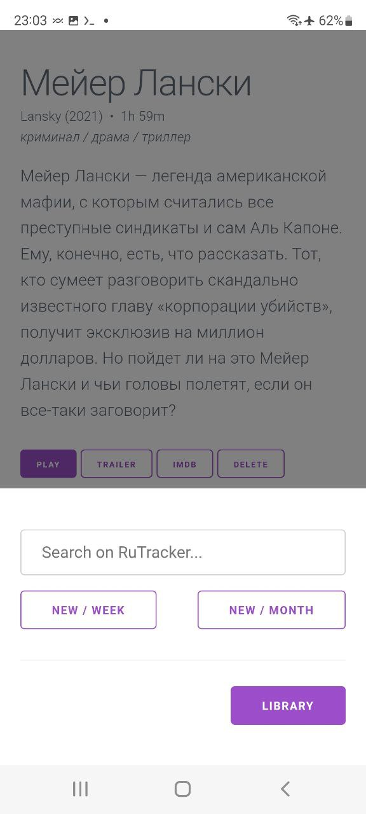
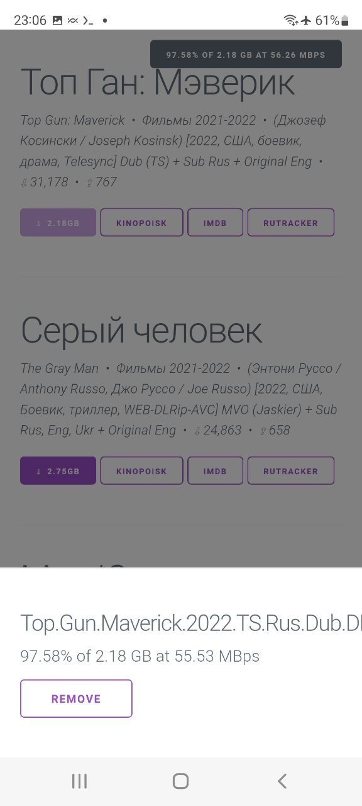

# kodi-companion

## Installation

### Kodi
Make sure that your Android's screen refresh rate is 60Hz, otherwise you will see a black screen in Kodi.

1. Install Kodi from Google Play or APK.
2. Add Video Source
	1. Settings (Gears icon) -> Media -> Videos... -> External Card -> Push and Hold on "Movies" -> Set content
	2. "This directory contains" = "Movies".
	3. In Settings you can choose preferred language, Default Rating source and etc.
3. Settings -> Services -> Control -> Allow remote control via HTTP -> Enable.
4. (optional) Media -> Videos -> Default select action -> Change to "Show information"
5. (optional) Movies -> Options ->
	1. ViewType set to InfoWall
	2. Sort by set to Date added
	3. Order set to Descending

- Install Library.Watchdog Add-on

### Installing on [Termux](https://termux.dev/)
Use [F Droid](https://f-droid.org/) to install Termux or install APK.
```bash
termux-setup-storage
pkg update && pkg install termux-api git nodejs sqlite iconv curl python
git clone https://github.com/argongym/kodi-companion.git
cd kodi-companion
npm install --no-bin-links
```

### Configuring kodi-companion
Before starting server you need to create config.json file. Script below will help you create it.
```bash
npm run config
```
Run the command and open http://127.0.0.1:3000/ in your web browser. Then copy config-tmp.json to config.json.
```bash
cp config-tmp.json config.json
```

### Starting a Server
```bash
npm run start
```
Run the command and open http://127.0.0.1:3000/ in your web browser.

## Tools

### Running a Dev Server on Your PC or Mac
```bash
npm install
npm run dev
```

### CloudFlare Reverse Proxy
Some countries block access to some websites. You can use reverse proxy to change URL's of those websites, while keeping all functionality.
```
./cloudflare/proxy.js
```

### [AutoMagic](https://automagic4android.com/download_en.html)
If you have an older Android version and you have "permission denied" errors when writing to an SD card then you should use Automagic to accomplish some tasks, such as rename, move, delete files on SD card and etc. Install Automagic and import flows.xml.
```
./automagic/Automagic_1_38_0.apk
./automagic/flows.xml
```
```bash
cp ./automagic/flows.xml /storage/emulated/0/Automagic/flows.xml
```

## Screenshots

### Library


### Menu


### Search


### Torrents

